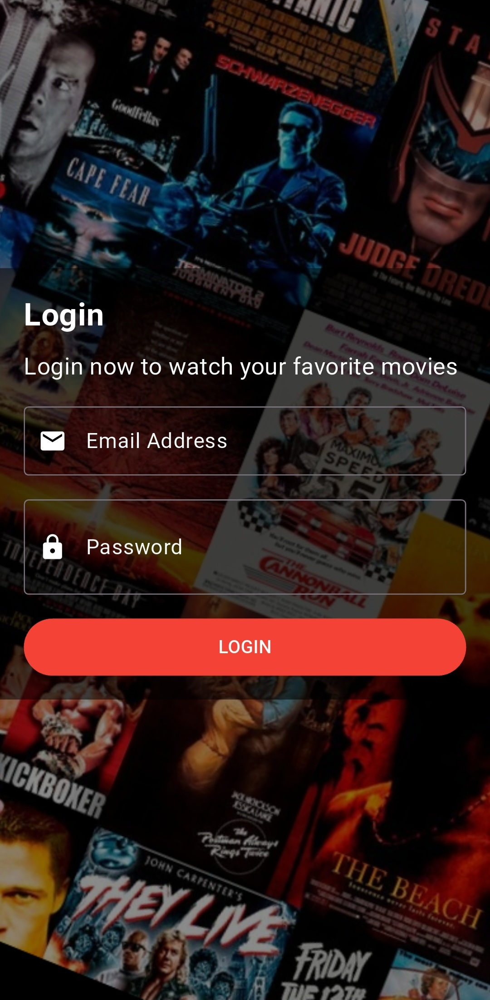
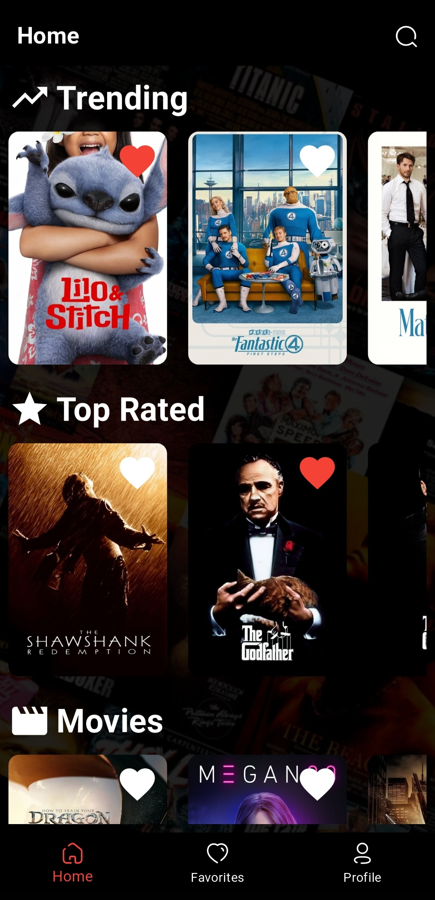
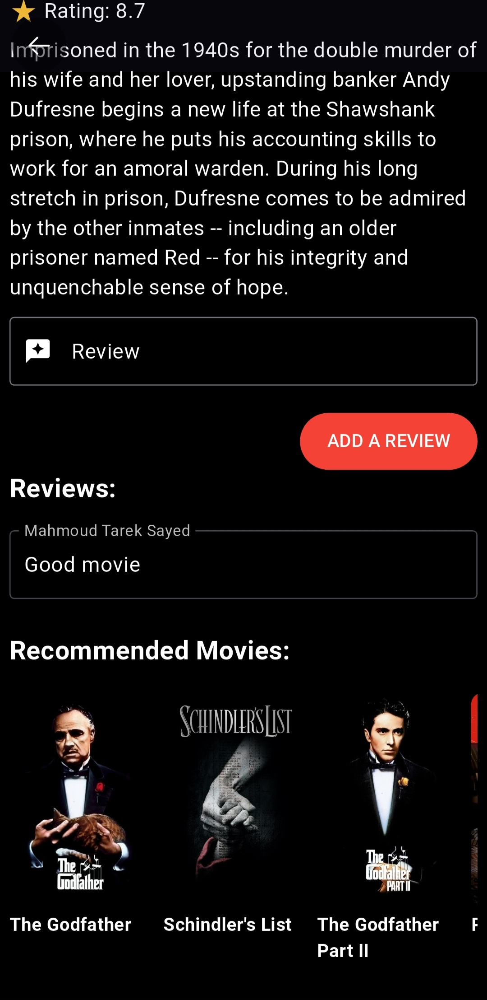
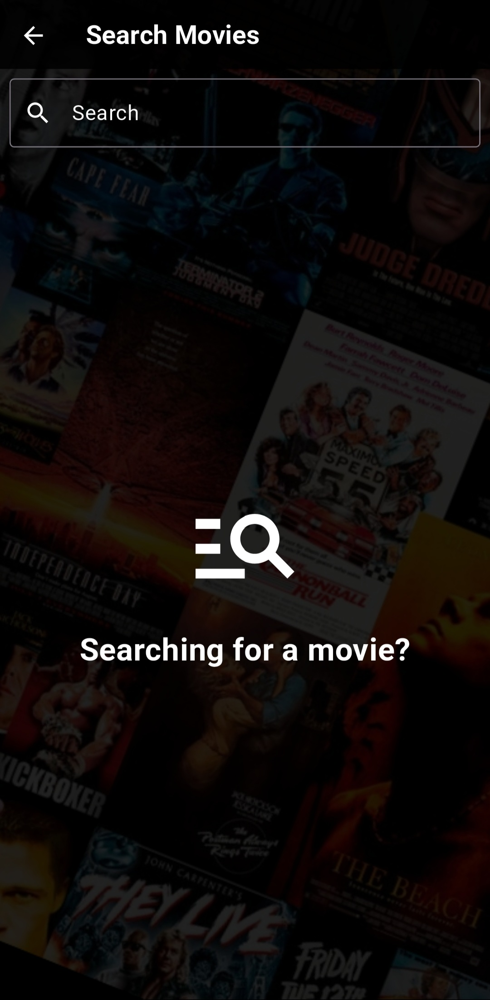
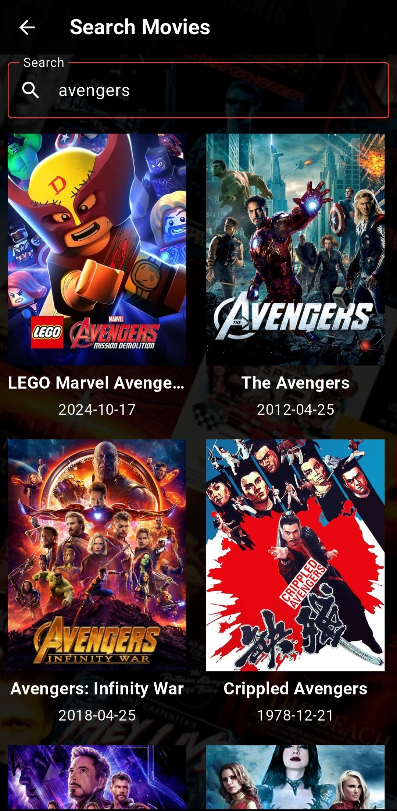

# Movies Application

Developed a Movies Application with a clean architecture using BLoC and TMDB API.

## Application Features

- Simple UI screens.
  
- Bottom navigation bar to switch between screens easily.
  
- Home screen that contains:
  
  Login screen.
  
  Trending Movies.
  
  Top Rated Movies.
  
  Upcoming Movies.

- Movie screen that contains:
  
  Details about the Movie.
  
  Reveiws on the Movie.
  
  Recommendation Movies.
  
- Series screen that contains:

  Details about the Serie.
  
  Reveiws on the Serie.
  
  Recommendation Series.
  
- User can add Reveiw for Movies & Series.
  
- User can add Movies & Series to Favorites.
  
- Favorites screen has user's favorites list.
  
- User can update Username & Email.
  
    

## Screenshots
  

  
  
  

  

  
  
  

  

  
  
  
</p3
3
